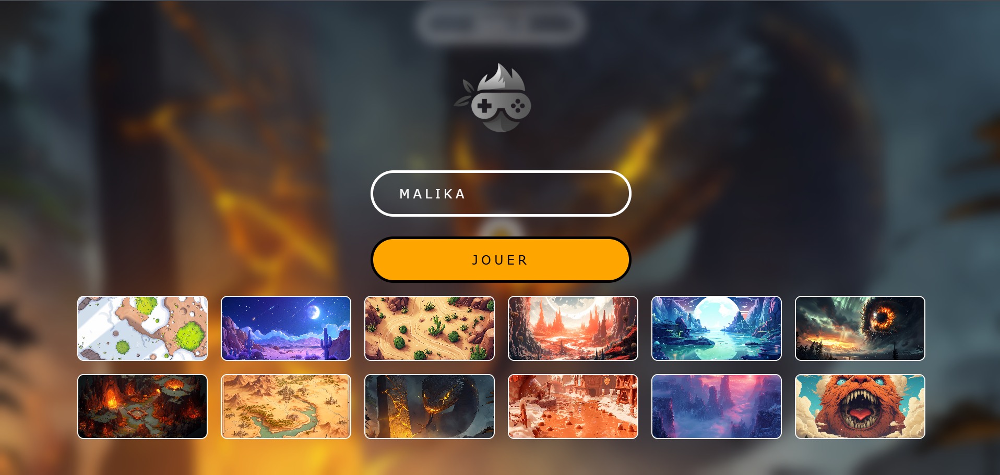
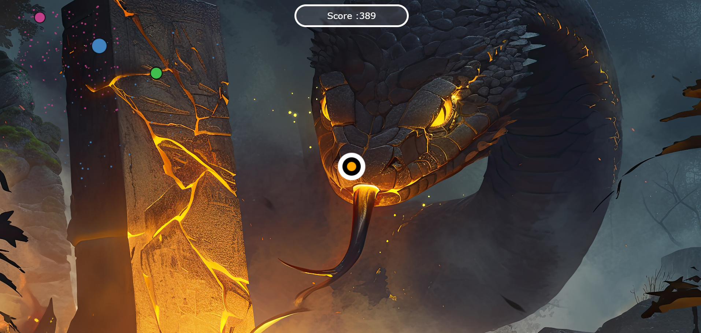
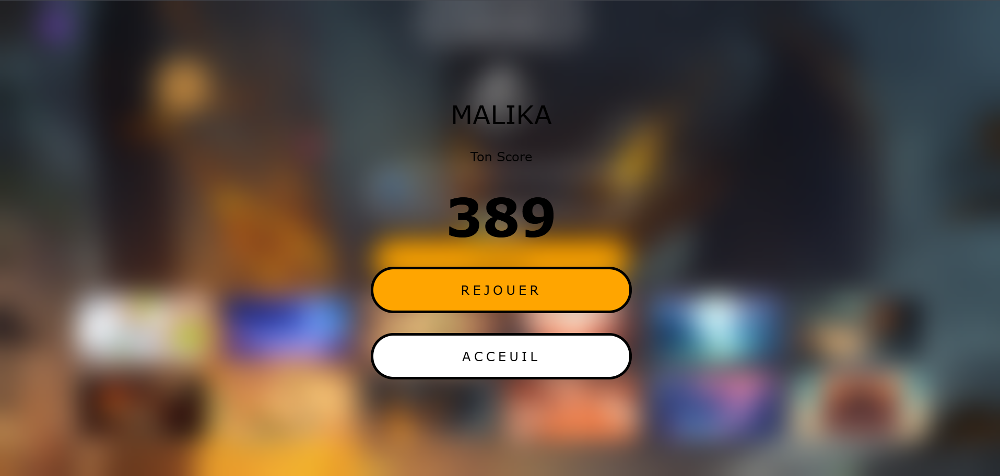

# 🎮 SHOOTING BALL

Un jeu de tir dynamique codé en **JavaScript** avec **Canvas API**, où vous incarnez un joueur au centre de l'écran et tirez sur des vagues d'ennemis générés aléatoirement.

---

## 🚀 Fonctionnalités

- 🧑‍🚀 Joueur positionné au centre du canvas
- 🔫 Tir automatique vers le curseur à chaque clic
- 🧟‍♂️ Ennemis générés hors-écran avec des trajectoires convergentes
- 💥 Collision projectile / ennemi avec effet de particules
- 🎯 Score calculé dynamiquement et sauvegardé via `localStorage`
- 💀 Détection de collision joueur / ennemi → fin de partie
- 📝 Interface de démarrage avec saisie du pseudo

---

## 🧩 Technologies utilisées

- `HTML5 Canvas`
- `JavaScript ES6`
- `GSAP` (GreenSock) pour les animations douces
- `LocalStorage` pour la persistance du score et du nom d'utilisateur

---

## 🕹️ Comment jouer

1. Saisissez votre nom d'utilisateur dans le formulaire.
2. Cliquez sur **JOUER**.
3. Choisissez la carte.
4. Cliquez n'importe où sur l'écran pour tirer dans la direction du curseur.
5. Survivez le plus longtemps possible en éliminant les ennemis.
6. Si un ennemi touche le joueur, la partie s'arrête et le score final est affiché.

---

## 📁 Structure du code

```text
📦 BALLS-SHOOTING
├── assets
|   ├──levels         
├── index.html         # Structure HTML avec le canvas et le formulaire
├── style.css          # Styles pour l’interface
├── script.js            # Toute la logique du jeu (classes, animation, collisions, événements)
├── load-map.js            # Toute la logique du jeu (function de chargement des maps)
└── README.md          # Ce fichier
```


## 📷 Aperçu du jeu





## ⚙️ Démarrage rapide

### 1. Cloner le dépôt

```bash
git clone https://github.com/votre-utilisateur/shooting-ball.git
cd shooting-ball
```

### 2. Ouvrir dans le navigateur

Tu peux simplement ouvrir le fichier `index.html` dans ton navigateur :


---

## 📦 Dépendances externes

- [GSAP](https://greensock.com/gsap/) (CDN à inclure dans ton HTML) :
```html
<script src="https://cdnjs.cloudflare.com/ajax/libs/gsap/3.12.2/gsap.min.js"></script>
```

---

## 🤝 Contributions

Toute contribution est la bienvenue : amélioration des performances, refactor, ajout de features, refonte graphique, etc.

---

## 📫 Contact

Pour tout retour, bug ou proposition :

- Email : `ibraumodnokpro@gmail.com`
- GitHub : [@ibraum](https://github.com/ibraum)

---
> *Keep shooting and stay sharp! 🔥 [_ I_B_M _]*